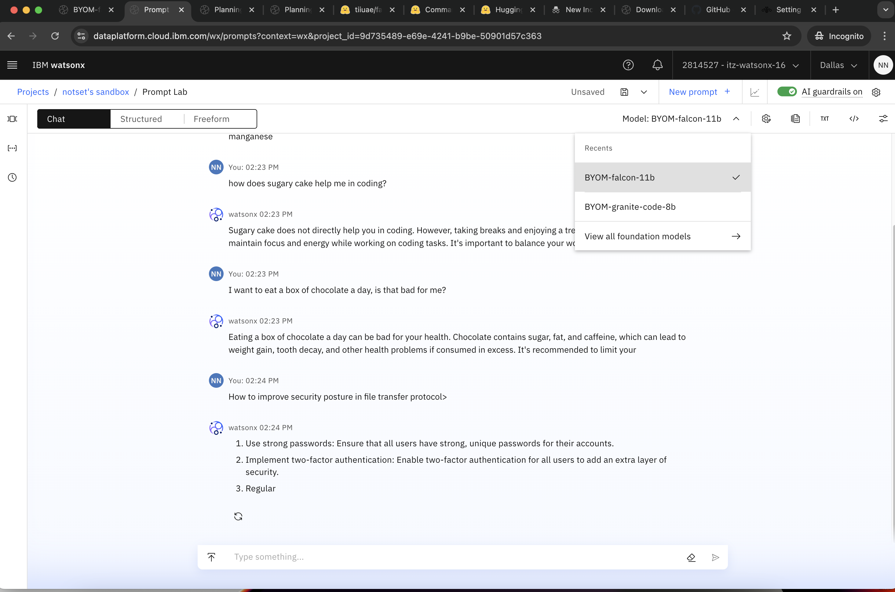
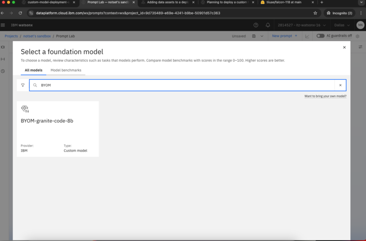
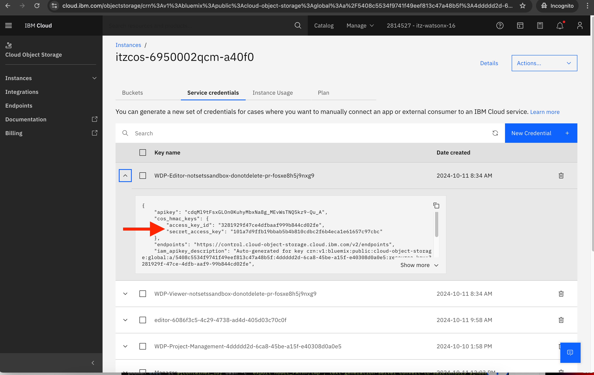
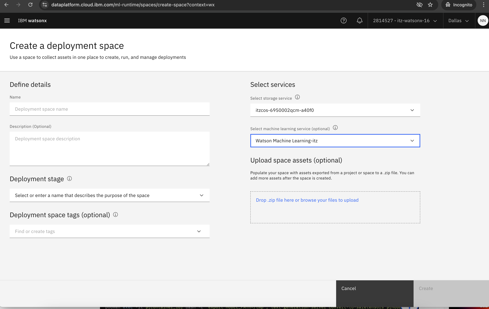
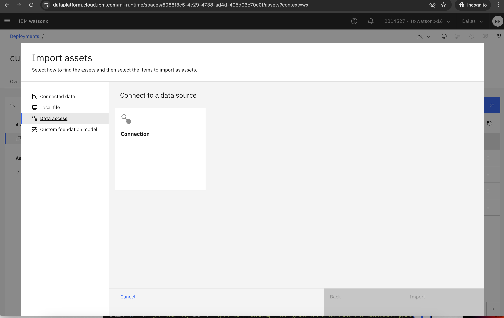
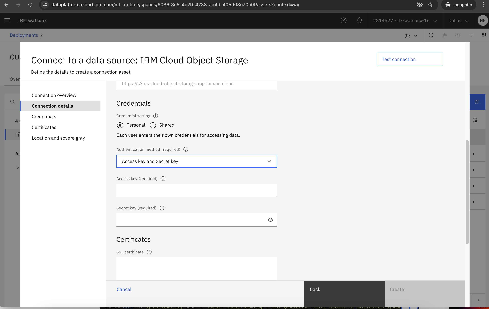
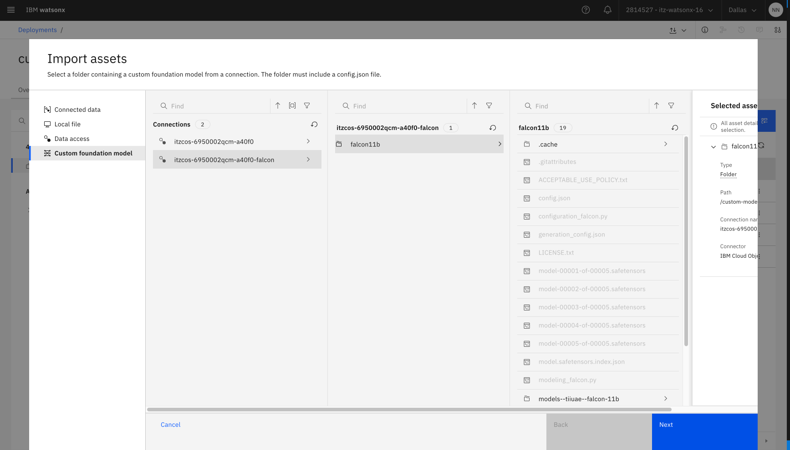
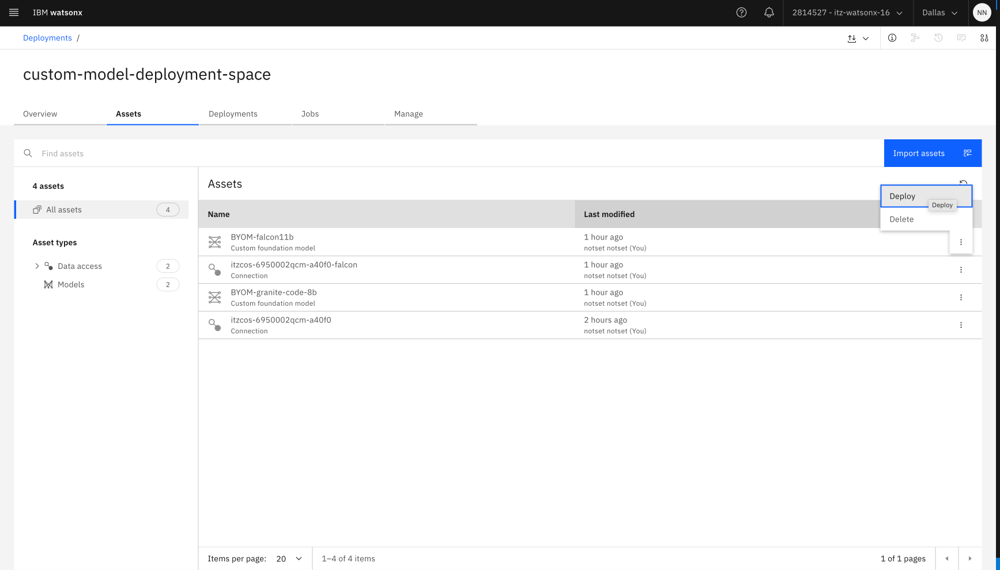

# Overview
This repository can be used to perfrom BYOM in Watsonx.ai

    1. Review custom foundational model requirements
    2. Download custom model via huggingface
    3. [Optional] Re-train model via instructlab
    4. [Optional] Convert model to required format
    5. Set up Cloud Object Storage and then upload the model
    6. Create connection between Watsonx.ai deployment space and Cloud Object Storage
    7. Import custom model in deployment space
    8. Create a deployment
    9. Interact with model in Prompt Lab

Endgoal


# 0. Before We Start:
0. For IBMers reserve environment on TechZone: WML with Standards licenses. 
1. establish local python environment 
```bash
python3 -m venv .venv
source .venv/bin/activate
pip install -r requirements.txt
```
2. establish environment variables. Export variables in your local terminal 
```bash 
# Downloading model: 
# Hugging Face Account token
export HF_TOKEN="hf_xxxxxxxxx"
# Selected model's name in Hugging Face
export HF_MODEL_NAME="tiiuae/falcon-40b"
# Which local directory to save the model to 
export LOCAL_MODEL_DIR="./model/falcon"

# Uploading model:
# IBM Cloud Object Storage access
export ACCESS_KEY_ID='xxxxxxxxx'
export SECRET_ACCESS_KEY='xxxxxxxxx'
# IBM Cloud Object Storage URL
export ENDPOINT="xxxxxxxxx"
export BUCKET_NAME = 'custom-model-falcon'
export COS_MODEL_FOLDER="falcon"
```
# 1. Review custom foundational model requirements
- [Documentation](https://dataplatform.cloud.ibm.com/docs/content/wsj/analyze-data/deploy-custom-fm-plan-cloud.html?context=wx&audience=wdp)
- Notes: The model folder must include `config.json`, `tokenizer.json` and the model content is in `.safetensors` format
- Restrictions: 
    - You cannot tune a custom foundation model.
    - You cannot use watsonx.governance to evaluate or track a prompt template for a custom foundation model.
    - You can prompt a custom foundation model but cannot save a prompt template for a custom model.

# 2. Download custom model via huggingface
- Navigate to [Hugging Face Tokens](https://huggingface.co/settings/tokens) to obtain an access token. 
- Run command to save the model locally. 
- Note: Ensure good internet connection and enough local storage space. 
```bash
huggingface-cli download ${HF_MODEL_NAME} --local-dir ${LOCAL_MODEL_DIR} --cache-dir ${LOCAL_MODEL_DIR}
```

# 3. [Optional] Re-train model via instructlab
- [Documentation](https://dataplatform.cloud.ibm.com/docs/content/wsj/analyze-data/deploy-custom-fm-storage-cloud.html?context=wx&audience=wdp&context=wx): Note that if the model was fine tuned with InstructLab, converstion to the `safetensors` format might not always be possible: 
    - Models that were fine-tuned in Linux environment require conversion.
    - Models that were fine-tuned on a Mac can't be converted.
    - Models that were fine-tuned and saved to the .gguf format (in any environment) cannot be converted.
    - Use this [repository](https://github.com/IBM/convert-to-safetensors) to convert InstructLab tuned model
# 4. [Optional] Convert model to required format
[Documentation](https://dataplatform.cloud.ibm.com/docs/content/wsj/analyze-data/deploy-custom-fm-storage-cloud.html?context=wx&audience=wdp&context=wx)
# 5. Set up Cloud Object Storage and then upload the model
- Note we can use command line interface to help us upload the model. `ACCESS_KEY_ID` and `SECRET_ACCESS_KEY` can be found in your `IBM Cloud Object Storage` reservation, in section `Service Credentials`
- 
```bash
aws --endpoint-url ${ENDPOINT} s3 cp ${LOCAL_MODEL_DIR} s3://${BUCKET_NAME}/${COS_MODEL_FOLDER}/ --recursive --follow-symlinks
```
# 6. Create connection between Watsonx.ai deployment space and Cloud Object Storage
1. Create a deployment space. Be sure to choose the save Cloud Object Storage as provisioned, as your storage service

2. In your new deployment space, go to Data access, then Connection, then select IBM Cloud Object Storage

3. Provide connection details. Be sure to select **"Personal"** Credential setting. Be sure to select **"Access key and Secret key"** Authentication method


# 7. Import custom model in deployment space
1. After connection detail is established, we can import the model into deployment space. 
2. Click on **Import asets** > Custom foundational model 


# 8. Create a deployment
1. Find the newly imported foundational model, and select **"Deploy"**


# 9. Interact with model in Prompt Lab
